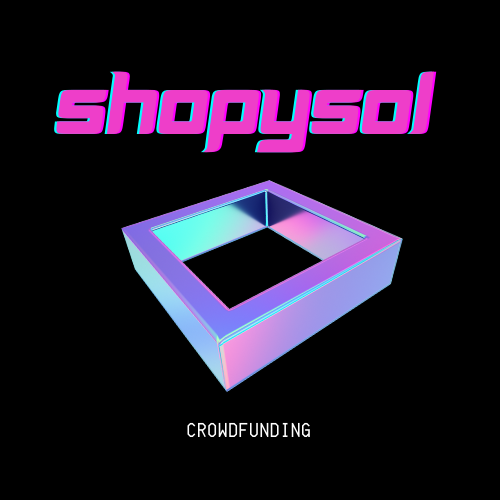

<br />
<div align="center">
  <a href="https://fundzkickstarter.vercel.app/">
    
  </a>

<h3 align="center">Fundz</h3>

  <p align="center">
    Web3 Crowdfunding Platform
    <br />
    <a href="https://github.com/iamyxsh/solana-crowdfunding/tree/master/programs/solana-crowdfunding"><strong>Explore the solana prgram</strong></a>
    <br />
    <br />
    <a href="https://fundzkickstarter.vercel.app/">View Demo</a>
    ·
    <a href="https://github.com/iamyxsh/solana-crowdfunding/issues">Report Bug</a>
  </p>
</div>

<!-- ABOUT THE PROJECT -->

## About The Project

[![Product Name Screen Shot][homepage]](https://fundzkickstarter.vercel.app/)

This app is built on top of Solana Blockchain to showcase my skills in the web3
world. 🌏

<p align="right">(<a href="#readme-top">back to top</a>)</p>

### Built With

- [![Next][next.js]][next-url]
- [![Tailwind][tailwind]][tailwind-url]
- [![Rust][rust]][rust-url]

<p align="right">(<a href="#readme-top">back to top</a>)</p>

<!-- GETTING STARTED -->

## Getting Started

### Prerequisites

You will need a few things set up before you can play around.

- npm
  ```sh
  npm install npm@latest -g
  ```
- rust
  ```sh
  curl --proto '=https' --tlsv1.2 -sSf https://sh.rustup.rs | sh
  ```
- solana
  ```sh
  sh -c "$(curl -sSfL https://release.solana.com/v1.14.11/install)"
  ```
- anchor
  ```sh
  cargo install --git https://github.com/project-serum/anchor anchor-cli --locked
  ```
- [Phantom Wallet][phantom-url]

### Installation

1. Clone the repo
   ```sh
   git clone https://github.com/iamyxsh/solana-crowdfunding
   ```
2. Install NPM packages
   ```sh
   cd /app && npm install
   ```
3. Start the NextJS app
   ```sh
   npm run dev
   ```

<p align="right">(<a href="#readme-top">back to top</a>)</p>

<!-- USAGE EXAMPLES -->

## Usage

In the DEVNET environment, use the app to create your own crowd funding project,
where you can set a goal and people can donate SOL to the project, which you can
then withdraw to your own wallet.

### Steps

<p align="right">(<a href="#readme-top">back to top</a>)</p>

- Connect your wallet
  [![Connect Wallet][connect-wallet]](https://fundzkickstarter.vercel.app/)

- Create your project
  [![Create Project][create-project]](https://fundzkickstarter.vercel.app/create)

- Fund a project
  [![Fund Project][fund-project]](https://fundzkickstarter.vercel.app/project?key=BTrespkCHNU2FkErRZSpZSqk1Lt8HZDgXZqJFPc88Vz5)

- Withdraw the SOL
  [![Withdraw SOL][withdraw-sol]](https://fundzkickstarter.vercel.app/profile)

<!-- CONTACT -->

## Contact

Yash Sharma - iamyxsh@icloud.com

<p align="right">(<a href="#readme-top">back to top</a>)</p>

<!-- MARKDOWN LINKS & IMAGES -->

[homepage]: images/homepage.png
[connect-wallet]: images/connect-wallet.png
[create-project]: images/create-project.png
[fund-project]: images/fund-project.png
[withdraw-sol]: images/withdraw-sol.png
[next.js]:
	https://img.shields.io/badge/next.js-000000?style=for-the-badge&logo=nextdotjs&logoColor=white
[next-url]: https://nextjs.org/
[phantom-url]: https://phantom.app/
[tailwind]:
	https://img.shields.io/badge/Tailwind_CSS-38B2AC?style=for-the-badge&logo=tailwind-css&logoColor=white
[tailwind-url]: https://tailwindcss.com/
[rust]:
	https://img.shields.io/badge/Rust-000000?style=for-the-badge&logo=rust&logoColor=white
[rust-url]: https://www.rust-lang.org/
